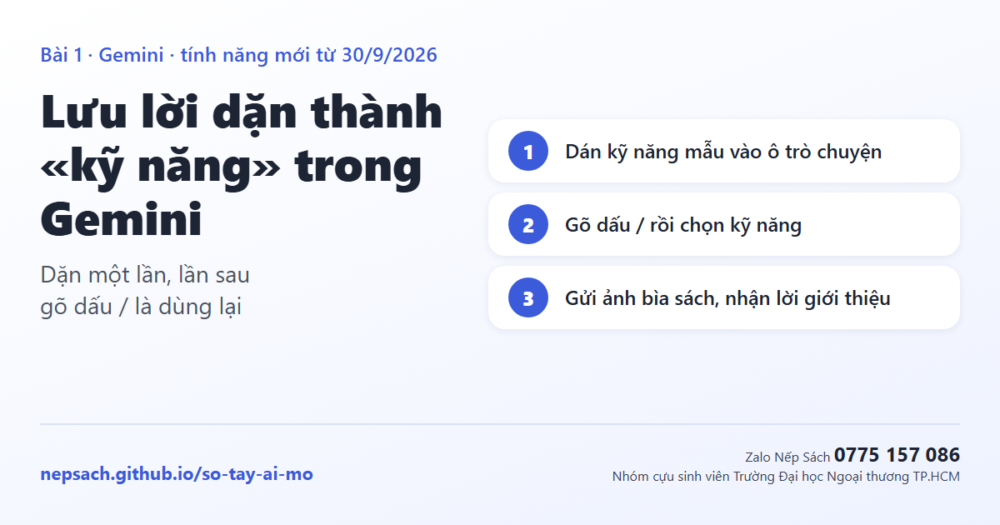

import { Steps, Badge } from '@astrojs/starlight/components';

<Badge text="5 phút" variant="note" /> <Badge text="Miễn phí" variant="success" /> <Badge text="Gmail cá nhân, từ 18 tuổi" variant="caution" /> <Badge text="Mới từ 30/9/2026" variant="tip" />

**Dặn Gemini một lần cách viết lời giới thiệu sách của thư viện. Lần sau gõ dấu / chọn kỹ năng, gửi ảnh bìa là có bài.**

Kỹ năng thay cho Gem: Gem của tài khoản cá nhân ngừng từ tháng 11/2026 và được Google tự chuyển thành kỹ năng.

## Làm trong 3 bước

<Steps>

1. **Bật «Lưu giữ hoạt động»** của Gemini (bắt buộc để dùng kỹ năng), đăng nhập bằng Gmail cá nhân.

2. **Dán kỹ năng mẫu bên dưới vào ô trò chuyện Gemini rồi gửi.** Gemini tự tạo và lưu kỹ năng. Làm được cả trên điện thoại.

3. **Dùng:** gõ dấu **/** → chọn **viết-lời-giới-thiệu-sách** → gửi ảnh bìa và 2–3 trang sách. Đọc lại, đối chiếu với sách thật rồi mới dùng.

</Steps>

:::tip[Kỹ năng mẫu: chép nguyên khối, sửa phần trong ngoặc]
Hãy tạo một kỹ năng dựa trên các chỉ dẫn sau:

Tên: viết-lời-giới-thiệu-sách

Mô tả: Viết lời giới thiệu sách để đọc dưới cờ hoặc phát thanh trong trường (tiểu học). Sử dụng khi người dùng gửi ảnh bìa, mục lục hoặc vài trang sách và nhờ giới thiệu sách.

Chỉ dẫn:
1. Chỉ viết dựa trên ảnh bìa, mục lục, các trang sách người dùng gửi.
2. Khoảng 350–400 chữ, đọc trong 3 phút: câu hỏi gợi tò mò; tên sách, tác giả, nhà xuất bản; nội dung chính, không kể hết kết thúc; điều học sinh học được; lời mời đến thư viện mượn sách.
3. Giọng ấm áp, câu ngắn, từ quen thuộc với học sinh (lớp 1 đến lớp 5); xưng «cô» hoặc «thầy».
4. Viết chữ thường, không dùng dấu sao, dấu thăng, không kẻ bảng.

Lỗi cần tránh: không bịa tình tiết, nhân vật không có trong trang sách; không ghi tên, lớp học sinh; không dùng lời quảng cáo như «tuyệt vời nhất».

Khi thiếu thông tin: chưa có ảnh bìa hoặc trang sách thì hỏi lại, không tự đoán.
:::

:::caution[Không gõ thông tin học sinh]
Khi «Lưu giữ hoạt động» bật, Google ghi rằng nội dung trò chuyện được dùng để cải thiện dịch vụ, kể cả huấn luyện AI, có nhân viên đánh giá xem một phần.
:::

## Thử nhanh trước khi dùng thật

| Thử | Kỹ năng phải |
|---|---|
| Gửi ảnh bìa một cuốn sách | Viết đúng độ dài, đúng giọng, không có dấu sao |
| Gọi kỹ năng mà **không gửi ảnh** | Hỏi lại, không tự viết |
| Hỏi về nhân vật **không có** trong trang đã gửi | Nói không có, không bịa thêm |

<strong>Xem thêm: viết kỹ năng thế nào cho tốt (theo Google)</strong>

- **Tên** bắt đầu bằng việc làm, viết thường, nối bằng gạch ngang.
- **Mô tả** 1–2 câu, có câu «Sử dụng khi…» để Gemini biết lúc nào tự dùng.
- **Chỉ dẫn ngắn**: cách làm, mẫu trình bày, lỗi cần tránh, phải làm gì khi thiếu thông tin.
- **Mỗi kỹ năng một việc.** Muốn soạn câu hỏi sau khi đọc thì tạo thêm kỹ năng «soạn-câu-hỏi-sau-khi-đọc»; Gemini dùng được nhiều kỹ năng cùng lúc.
- Muốn sửa: nói tiếp trong cuộc trò chuyện, ví dụ «sửa kỹ năng viết-lời-giới-thiệu-sách: viết ngắn lại còn 250 chữ».

<strong>Xem thêm: cách tạo trên máy tính, giới hạn hiện tại</strong>

- Trên máy tính: gemini.google.com → **Cài đặt** → **Kỹ năng** → **Tạo thủ công** → điền tên, nội dung mô tả, chỉ dẫn → **Tạo**. Mục «Đề xuất» có kỹ năng mẫu của Google.
- Lỗi Google đang sửa: kỹ năng **tạo thủ công trong ứng dụng điện thoại chưa lưu được**; trên điện thoại hãy tạo bằng cách dán vào ô trò chuyện.
- Google cho biết dấu **/** sắp đổi thành **@**.
- Kỹ năng chưa chạy cùng Canvas, Deep Research; chưa nhận tệp Word, Excel (nhận văn bản thuần, PDF, ảnh).
- Google hẹn trong những tuần tới cho **chia sẻ kỹ năng** và gắn tệp từ Google Drive, Gemini Notebook. Tài khoản trường cấp hiện chưa dùng được kỹ năng.
- Mỗi lúc bật tối đa 100 kỹ năng. Gem cũ được tự chuyển thành kỹ năng.

:::note[Nguồn, ngày tra]
Trợ giúp Gemini bản tiếng Việt: «Tạo và quản lý kỹ năng», «Viết những kỹ năng hiệu quả», «Chuyển đổi từ Gem sang kỹ năng»; blog Google 30/9/2026. Tra ngày 4/10/2026. Ảnh trong thẻ: Google.
:::
